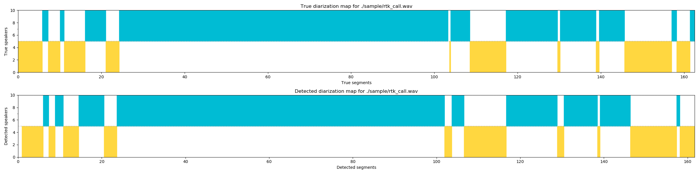

# Гайд по использованию модуля диаризации

## Описание
Главным скриптом в пакете является `diarization.py`, в нем происходит вся "магия".
В текущей реализации не используется (и *возможно* не будет) нейронная сеть, которая сегментирует участки. Вместо этого 
данный этап отдан на откуп алгоритму `HDBSCAN`. Есть возможнось использовать и просто DBSCAN, однако необходимо подобрать
значения `eps` и `min_samples`. Также возможны вариации с применением `UMAP`, до того, как кластеризовать полученные
эмбеддинги.

## Структура модуля
```
 |---pre_trained
 |   |---weights.h5
 |---sample
 |   |---img
 |   |   |---dbscan_umap.png
 |   |---rtk.call.wav
 |   |---true.txt
 |---backbone.py
 |---diarization.py
 |---model.py
 |---player.py
 |---README.md
 |---toolkits.py
 |---utils.py
 |---viewer.py
```

## Описание скриптов и файлов
Основные скрипты:
* `diarization.py`. Главный скрипт, который проводит сегментацию.
* `utils.py`. Содержит некоторые вспомогательные функции, например dbscan, hdbscan, визуалиацию в TensorBoard.
 
# Результат
Для примера была вложена запись разговора из Ростелекома. После сегментации получим следующий вывод.

<div align="center">
    
</div>

Верхний пустой график служит для отображение настоящей разметки. В настоящее время эта функция багованная, я работаю над
ее нормальным функционированием. Нижний показывает сегментированную запись (подписи в помощь).

В консоли отобразятся полученные таймстемпы.
```
========= 0 =========
0:00.896 --> 0:06.16
0:07.323 --> 0:08.816
0:10.795 --> 0:14.448
0:20.501 --> 0:23.603
1:41.906 --> 1:43.648
1:46.538 --> 1:56.624
2:08.846 --> 2:10.422
2:18.452 --> 2:19.74
2:26.274 --> 2:37.370
2:38.100 --> 2:41.682
========= 1 =========
0:06.16 --> 0:07.323
0:08.816 --> 0:10.795
0:14.448 --> 0:20.501
0:23.603 --> 1:41.906
1:43.648 --> 1:46.538
1:56.624 --> 2:08.846
2:10.422 --> 2:18.452
2:19.74 --> 2:26.274
2:37.370 --> 2:38.100
```
